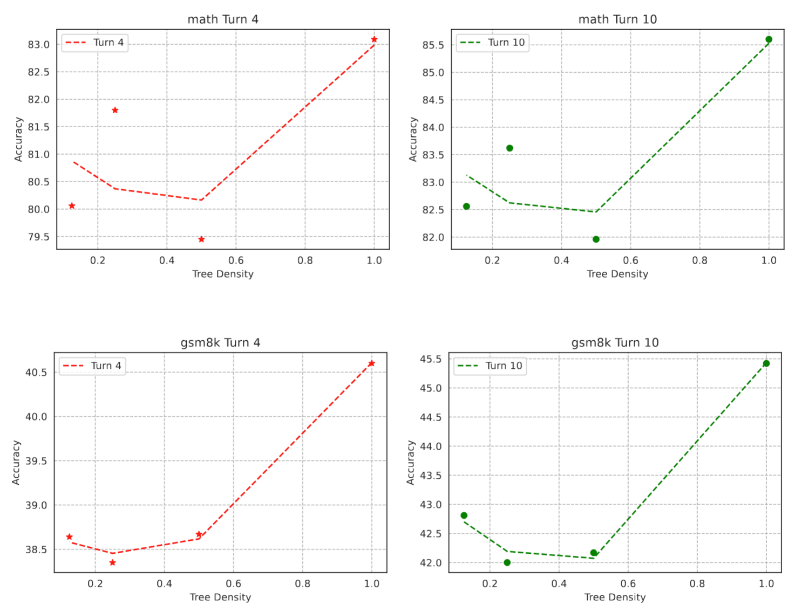
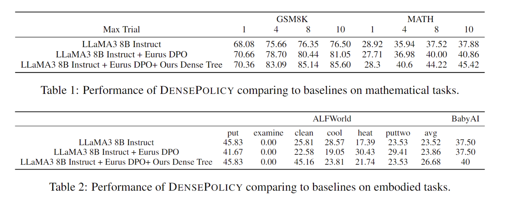

<h1 align="center"> DensePolicy: Empowering Language Agents Learning through Scaling of Trajectory Density </h1>

## News

**2024.10.20** The paper is coming soon!

## Overview

In this work, we tackle the issue of poor data efficiency in LLM agent post-training by introducing a method called dense tree approximation of trajectory space, a simple yet effective approach that significantly enhances LLMs' general agent abilities, particularly for the causal understanding of tasks, leading to better planning and self-correction. 

As illustrated in Figure \ref{fig ratio}, by dividing the sample size into two distinct dimensions—task number and trajectory density—we demonstrate that increasing trajectory density can significantly improve agent performance, even with a fixed total number of samples. 



As the experiments demonstrate, the dense trajectory preference learning significantly enhances the LLM’s long-term planning ability. In particular, the model’s reflection method shows substantial improvement in the mathematical domain, a skill that is difficult to acquire from sparse trajectory samples. The model’s planning ability in embodied tasks also improves, further supporting that dense approximation is crucial for both various agent tasks and general planning abilities.




## Installation

To run DensePolicy, please clone the repository and all the submodules to your local machine and install the required dependencies using the script provided. The environment have been tested with `CUDA 12.2`. If you're using a different version of Python, you might need to adjust the versions of the packages accordingly.

```
conda create -n agent_env python=3.10 -y
source activate agent_env

pip install numpy==1.26 
pip install vllm==0.4.1 torch==2.2.1 

pip install -r requirements.txt torch==2.2.1 vllm==0.4.1 

pip install openai 

pip install setuptools_scm 
pip install fschat 
pip install astor 
pip install tiktoken 
pip install pydot 
pip install IPython matplotlib 

cd dataset
git clone https://github.com/microsoft/TextWorld/
cd TextWorld
pip install -e . 
cd ..

git clone https://github.com/alfworld/alfworld.git alfworld
cd alfworld
pip install -r requirements.txt torch==2.2.1 
pip install -e . 
export ALFWORLD_DATA=./
python scripts/alfworld-download
cd ..
cd ..

# agentgym install
cd dataset
cd AgentGym
cd agentenv
pip install -e . 
cd ..
cd ..
cd ..
```

## Tree Data Sampling

Run the tree data creation via the following script:

```
./distributed_test.sh $model_dir $dataset codeact_agent_tree $process_per_gpu $tmux_start_id
```

For example:
```
./distributed_test.sh Meta-Llama-3-8B-Instruct math codeact_agent_tree 10 0
```

After running, post process the data by 

```
python post_process_test_result.py --merge_distributed_result --data_dir eval_results/codeact_agent_tree.Meta-Llama-3-8B-Instruct/temperature_512_10_8/ --dataset_file_name_list math.None_split_0.0.{}.csv
```

Then generate tree data for preference learning by 

```
python post_process_training_data.py --process_result --data_dir eval_results/codeact_agent_tree.Meta-Llama-3-8B-Instruct/temperature_512_10_8 --dataset_file_name_list math.None_split_0.0.{}.csv --data_sub_dir math --dataset_file_name math.None_split_0.0.None.csv

python post_process_training_data.py --merge_all_pairs

python prepare_dataset.py
```

## Preference Learning

We use llama-factory as the preference learning pipeline. See directory TreeDPO for the preference learning process.

## Downstream Test

Run the downstream test via the same script as data sampling:

```
./distributed_test.sh $model_dir $dataset codeact_agent $process_per_gpu $tmux_start_id
```

For example:
```
./distributed_test.sh Meta-Llama-3-8B-Instruct/full/tree_dpo_temperature_256_put_cool_babyai_math_8_30_1000_0.5_math_more gsm8k codeact_agent 10 0
```